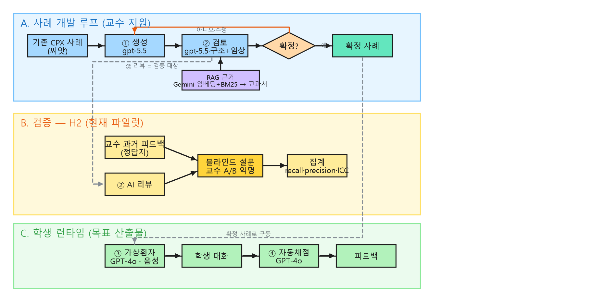
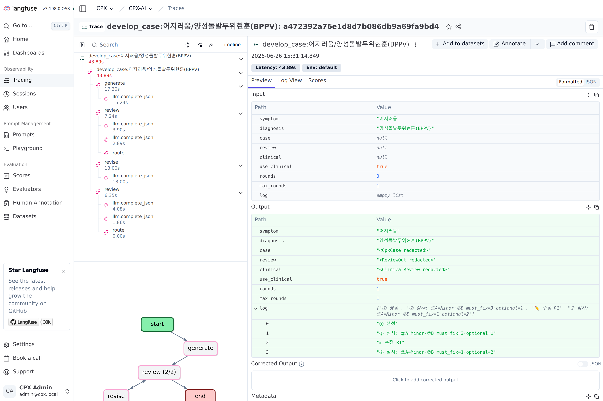

# CPX-AI — 임상수행평가(CPX) 사례 개발·검증·시뮬레이션 연구

> ⚠️ **학술 연구 프로젝트** — 양산부산대학교병원, 연구책임자 **PI** 교수.
> **교육 전용 · 임상 사용 금지 · 비영리.** 프로젝트 본질·규약 = [`AGENTS.md`](AGENTS.md).

의과대학 CPX(Clinical Performance Examination) 교육을 위해, **기존 사례를 변형해 새 사례를 생성하고(①), AI가 검토하고(②), 가상환자로 학생을 훈련시키고(③), 자동 채점(④)** 하는 4-에이전트 파이프라인과 그 **검증 하네스**입니다. 모든 단계는 **투명성·재현성**을 원칙으로 합니다.

> **🔑 현재 최우선 방향 (2026-07):** **온톨로지 지식그래프로 근거 기반 생성** — 지도교수 비전. 구조화된 지식(원인·증상·질환) 안에서 LLM이 *아무렇게나가 아니라 근거를 갖고* 사례를 만들도록 한다. 진입점 = [`docs/blueprint.md`](docs/blueprint.md) · 정본 = [`docs/ontology-plan.md`](docs/ontology-plan.md).

## 작동방식



> 편집 = [`docs/cpx-flow.excalidraw`](docs/cpx-flow.excalidraw) ([온라인 편집](https://excalidraw.com/#json=MDRx6v86yhWXLqAxpekQJ,WzNaXnBRwxKblOzIa5XZeA)) · mermaid 원본 = [`docs/cpx-flow.md`](docs/cpx-flow.md)

- **A. 사례 개발 루프** — 기존 CPX 사례(씨앗) → ① 생성(**온톨로지 지식그래프 제약** — 필수요소 강제) → ② 검토(구조+임상, RAG 근거) → 교수 확정. 확정 전까지 수정 루프.
- **B. 검증 (H2, 현재 파일럿)** — ②의 AI 검토가 교수의 과거 피드백을 얼마나 재현하는지, 교수 블라인드 설문으로 측정(recall·precision·ICC).
- **C. 학생 런타임 (목표 산출물)** — 확정 사례 → ③ 가상환자 대화 → ④ 자동 채점·피드백.

## 차별점 (예정)

> 아래는 **완성·공개 시점**의 차별점입니다. 현재는 구현·검증이 진행 중이라 시제를 정직하게 **(예정)** 으로 표기합니다(과대주장 금지 — 아래 "한계(정직성)" 참조).

- **A. 임상 전문가 검증 루프 (예정)** — 의대교수(PI)가 ① 생성·② 검토 루프와 **시스템 프롬프트**를 직접 검증하고, **검증을 통과한 사례·프롬프트만 공개**한다(전문가 피드백으로 프롬프트를 다듬음). 단순 프롬프트 튜닝이 아니라 *expert-in-the-loop*. *(현재: H2 검증 교수 응답 대기 — [`docs/validation-design.md`](docs/validation-design.md))*
- **B. 재현성·투명성 (예정)** — 오픈소스(부산대 무료)이며, 블랙박스가 아니라 다음을 **공개**한다:
  - **시스템 프롬프트 공개** *(코드 내 구현됨 — 공개 예정)*
  - **실행 트레이스 공개** — LangSmith·Langfuse로 파이프라인 전 단계(생성→심사→수정)를 추적해 **누구나 재현·감사 가능**. 트레이스는 **사례·교과서(RAG) 본문을 자동 마스킹(redaction)** 하여 공개 — 구조·지연·토큰·해시만 남고 부산대 사례·저작권 본문은 비노출(③·④ 실제 학생 상호작용은 추적 제외). *(추적+redaction 구현됨 — 공개 예정, [`src/cpx/tracing.py`](src/cpx/tracing.py))*
- **C. 근거 기반 생성 — 온톨로지 지식그래프 + LLM wiki (예정)** — 자유 LLM 생성이 아니라, 의학 지식을 **온톨로지로 설계해 지식그래프**(주증상·질환·증상/징후·감별·red flag·체크리스트·과공개 규칙)로 만들고, 그 그래프가 **사례에 반드시 포함할 필수요소를 강제**해 누락·날조를 **줄이는 것을 목표로 한다**(효과는 측정 후에만 주장 — 아래 "한계" 참조). 지식은 **3층 분담**(경쟁 아닌 보완): **지식그래프**=관계·감별·생성 뼈대 / **LLM wiki·롱컨텍스트**=정제지식(CPX 형식·루브릭) / **RAG**=큰 교과서(조연). 생성 사례는 **결정론 validator**(LLM 0회)가 온톨로지 카드와 대조 — **"환자가 가졌나(positive) vs 학생이 선별했나(asked)"를 분리 측정**하고 과공개·필수요소 누락을 검출(표준 온톨로지가 못 하는 CPX 고유 규칙; **Codex 6라운드 적대검수 APPROVED**). 저장은 **YAML 정본 + Neo4j 지식그래프 렌더**(거울). *(흉통 1개부터 착수 — 임상 내용은 교수 검증 전 draft, Neo4j 전환 시점·범위는 지도교수 결정. [`docs/ontology-plan.md`](docs/ontology-plan.md) · [`src/cpx/ontology_validator.py`](src/cpx/ontology_validator.py) · `docs/chest_pain-graph.html`)*

### 공개 트레이스 예시 (redaction 적용)

실제 사례개발 그래프를 **1회 라이브 실행**한 추적. 흐름·노드·소요시간 같은 비민감 정보는 그대로 두고, **사례·교과서(RAG) 본문은 자동 마스킹**(길이+sha256). **셀프호스트 Langfuse**(데이터가 이 머신 밖으로 나가지 않음)에 올린 실제 대시보드에서도 Output의 `case/review/clinical`이 전부 `<… redacted>`로 표시된다.

- 정본(텍스트) = [`docs/sample-trace-redacted.md`](docs/sample-trace-redacted.md)
- 셀프호스트 셋업 = [`docs/langfuse-selfhost.md`](docs/langfuse-selfhost.md)
- 재현 = `CPX_TRACE_ACK=1 PYTHONPATH=src .venv/bin/python scripts/sample_trace.py`

셀프호스트 Langfuse 대시보드 (Output 본문이 모두 마스킹 + 하단에 그래프 흐름):


## 데이터·코퍼스

| 용도 | 내용 | 출처 | 공개 |
|---|---|---|---|
| **CPX 사례** (생성 씨앗 · 검증 정답지) | hwp 170건(최종 85·초안 80·피드백 5) | 부산대 양산병원(연구책임자) | 🔒 비공개 — 학교자산·비식별·gitignore |
| **RAG 교과서 코퍼스** | 영문 의학교과서 18권(Harrison·Robbins·Schwartz·Janeway·Williams 등) | 공개 의학 QA 데이터셋 [jind11/MedQA](https://github.com/jind11/MedQA)의 textbooks 배포본 | 🔒 원저작권(각 교과서) — 비공개·gitignore |
| RAG 인덱스(현재) | 위 코퍼스 중 Harrison 1권 샘플(1,200 청크) | 위에서 색인 | 🔒 gitignore |
| **공개 재현 데이터** | 가상(합성) CPX 사례 | 자체 제작 | ✅ `data/toy/` |

- 학교자산(사례·피드백)과 저작권 교과서는 **git 커밋 금지.** 외부 API에는 **비식별 데이터만** 입력하며, **재학습(파인튜닝)하지 않습니다**(프롬프트 + RAG 방식).
- 데이터·코퍼스·임베딩 정책 단일 정본 = [`docs/transparency.md`](docs/transparency.md).

## 모델 (컴포넌트별)

| 컴포넌트 | 모델 | 상태 |
|---|---|---|
| ① 사례 생성 | gpt-5.5 (OpenAI) | 프로토타입 |
| ② 사례 검토 *(검증 대상)* | gpt-5.5 (OpenAI) | 검증 진행 |
| ③ 가상환자 · ④ 자동채점 | GPT-4o (OpenAI) | 미구현 |
| RAG 임베딩 (dense) | gemini-embedding-001 (Google) | 사용 중 |
| RAG 검색 (sparse) | BM25 — 로컬, API 없음 | 사용 중 |
| 보조 · 사례 변환(ingest) | gemini-2.5-flash (Google) | 사용 중 |

> 모델 교체 지점 = [`src/cpx/llm.py`](src/cpx/llm.py) (모델명 prefix로 Claude/GPT/Gemini 자동 라우팅). 컴포넌트별 상세·근거 = [`docs/transparency.md`](docs/transparency.md).

## 빠른 시작

```bash
python3 -m venv .venv && .venv/bin/pip install -r requirements.txt
cp .env.example .env          # GOOGLE_API_KEY · OPENAI_API_KEY (재학습 없는 티어)

PYTHONPATH=src .venv/bin/python demo_grade.py        # ④ 채점: 키워드 v0 vs LLM(의미)
PYTHONPATH=src .venv/bin/python demo_loop.py         # 사례→가상환자 대화→채점 루프
PYTHONPATH=src .venv/bin/python demo_debrief.py      # 질적 디브리핑(유도성·전문용어·리라이트)
PYTHONPATH=src .venv/bin/python harness_smoke.py     # 검증 smoke: accuracy·P·R·F1·kappa
PYTHONPATH=src .venv/bin/python adversarial_smoke.py # 채점 강건성(동의어·헛공감·유도성)
PYTHONPATH=src .venv/bin/python vp_probe.py          # 가상환자: 과공개·일관성 probe
```

## 구조

```
src/cpx/   models · llm(어댑터) · rag(하이브리드 검색) · agents/{reviewer,grader,patient,debrief} · harness/{metrics,runner}
scripts/   ingest(hwp→CpxCase) · build_validation_data · aggregate_validation · build_excali(다이어그램)
web/       adjudication(H2 검증 설문 — 비식별 항목만, 암호게이트, 분리 배포)
docs/      blueprint(단일 진입점) · ontology-plan(온톨로지 정본) · transparency(모델·데이터) · architecture(v3) · data-inventory · cpx-flow · validation-design · handoff · roadmap · worklog
data/      toy(공개) · raw_private🔒 · working🔒
```

## ⚠️ 한계 (정직성)

- 현재는 **엔지니어링 smoke 단계**(손-라벨·소표본). **타당성(kappa) 주장이 아닙니다.**
- **온톨로지 "근거 기반 생성" 효과**(누락·모순 감소)는 정량 측정(필수요소 누락률·모순율·교수 accept율) **후에만** 주장합니다. 온톨로지 임상 내용은 교수 검증 전 **draft**입니다.
- H2 검증은 **feasibility 파일럿**(사례 6건) — "AI가 전문가에 필적/대체한다"고 **주장하지 않습니다.**
- 실제 학생 transcript + 임상교원 라벨로 본검증을 거친 뒤에만 타당성을 논합니다.

## 라이선스

- **코드**: 추후 오픈소스 라이선스 검토(MIT 등).
- **데이터·코퍼스**: 비공개(학교자산 · 교과서 저작권). 본 저장소는 데이터를 배포하지 않습니다.
