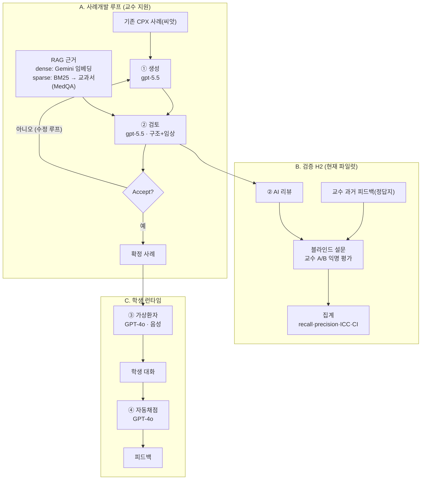

# CPX-AI — 한국 CPX(임상수행평가) AI 채점·시뮬레이션

> ⚠️ **학술 연구 프로젝트**(양산부산대학교병원). **교육 전용 — 임상 사용 금지.** 비영리·오픈소스 지향(MedQA식). 프로젝트 본질·규약은 [`AGENTS.md`](AGENTS.md).

## 무엇
의대 CPX 연습용: **④ 자동채점 · ③ 가상환자 · ② 심사 · ① 사례생성** + 검증 하네스. 투명·재현 가능을 원칙으로.

## 작동방식
> GitHub·노션에서 자동 렌더. 편집용 그림 = [`docs/cpx-flow.excalidraw`](docs/cpx-flow.excalidraw) ([온라인 편집](https://excalidraw.com/#json=MDRx6v86yhWXLqAxpekQJ,WzNaXnBRwxKblOzIa5XZeA)) · 상세 = [`docs/transparency.md`](docs/transparency.md)



## 빠른 시작
```bash
python3 -m venv .venv && .venv/bin/pip install -r requirements.txt
cp .env.example .env          # GOOGLE_API_KEY 등 (no-training 티어)
PYTHONPATH=src .venv/bin/python demo_grade.py       # ④ 채점: v0(키워드) vs LLM(의미)
PYTHONPATH=src .venv/bin/python demo_loop.py        # 사례→가상환자 대화→채점 (루프)
PYTHONPATH=src .venv/bin/python demo_debrief.py     # 질적 디브리핑(유도성·전문용어·리라이트)
PYTHONPATH=src .venv/bin/python harness_smoke.py    # H4-smoke: accuracy·P·R·F1·kappa
PYTHONPATH=src .venv/bin/python adversarial_smoke.py # 채점 강건성(동의어·헛공감·유도성)
PYTHONPATH=src .venv/bin/python vp_probe.py         # 가상환자: 과공개·일관성 probe
```
공개 재현 데이터 = `data/toy/`(가상 사례). 실제 부산대 사례는 비공개(`data/raw_private/`, gitignore).

## 구조
```
src/cpx/  models · llm(어댑터) · agents/{grader,patient,debrief} · harness/{metrics,runner}
scripts/  quarantine(격리·인벤토리) · ingest([붙임2]→CpxCase)
docs/     architecture · context-map · research-llm-cpx-sota · roadmap · data-governance · validation-registry · worklog
data/     toy(공개) · cases · transcripts · fixtures · adversarial · raw_private🔒 · working🔒
```

## ⚠️ 한계 (정직성)
현재 = **엔지니어링 smoke**(손-라벨·소표본). **타당성(kappa) 주장 아님** — 실제 학생 transcript + 임상교원 라벨로 H4-real 후에만. **"AI=인간 동등" 주장하지 않음.**

## 라이선스
(추후: MedQA처럼 MIT 검토)
