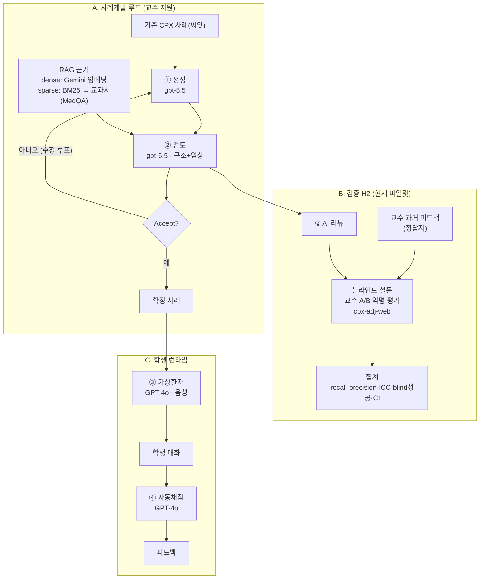

# CPX-AI 작동방식 (다이어그램)

> GitHub·노션에서 아래 블록이 자동 렌더됩니다. 편집 그림은 `cpx-flow.excalidraw`(excalidraw.com), 원본 mermaid는 `cpx-flow.mmd`.
> 모델·데이터 상세 = [`transparency.md`](transparency.md) · 검증 설계 = [`validation-design.md`](validation-design.md)

**핵심:** Claude(계획서)→결제 보류로 ①② = **gpt-5.5**, ③④ = GPT-4o, RAG 임베딩 = Gemini. 어댑터(`llm.py`)라 결제 풀리면 Claude로 1줄 교체.
